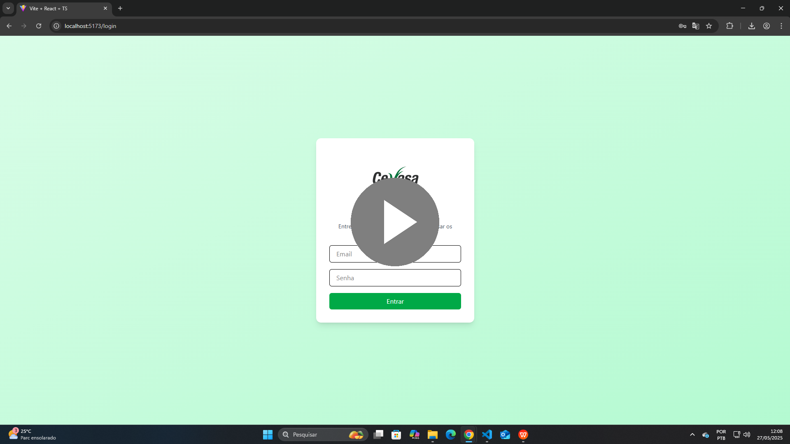
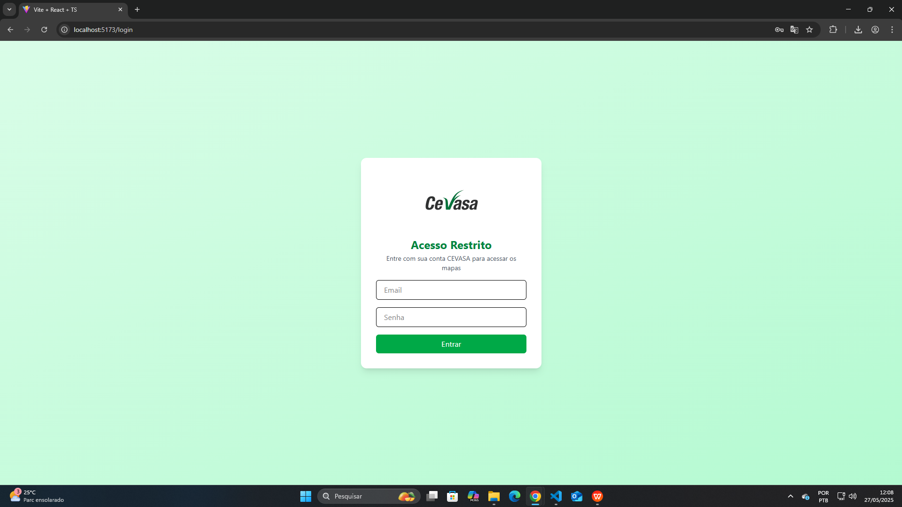
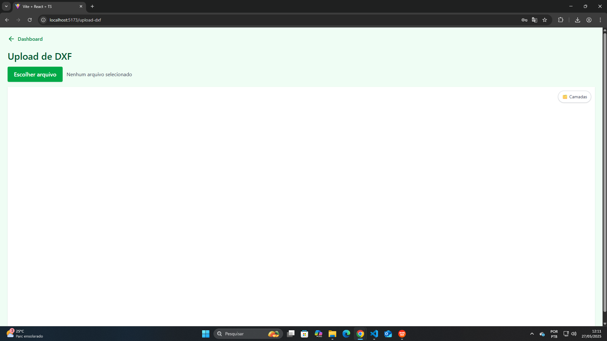
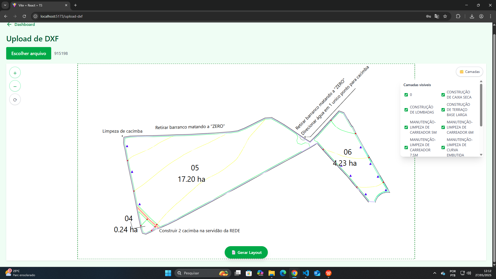
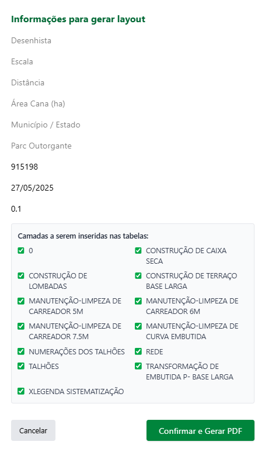
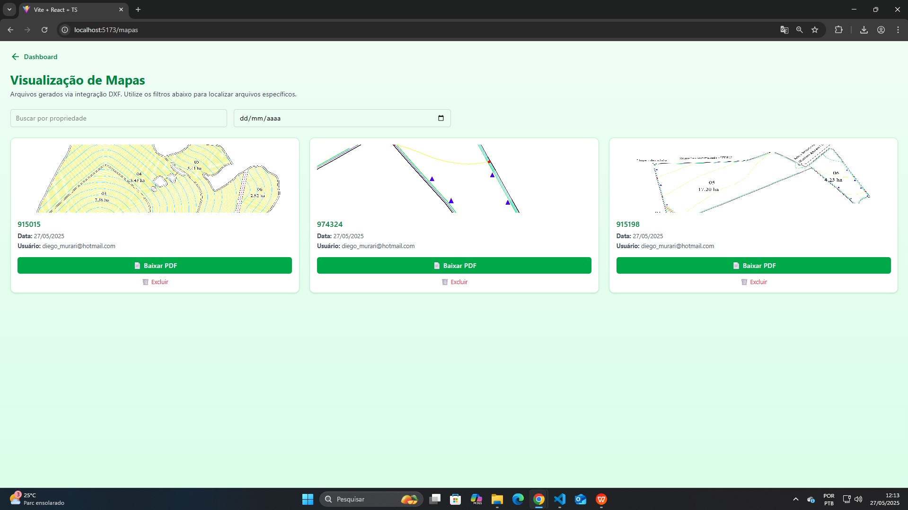

## 🎥 Demonstração em Vídeo

Clique na imagem abaixo para assistir a uma demonstração em vídeo completa do sistema:

---

## 🚀 Demonstração

---

### 🔐 Login

Tela inicial para autenticação do usuário no sistema.

---

### 📤 Upload

Área para envio de arquivos DXF, permitindo que o usuário selecione e visualize os arquivos que serão processados.

---

### 📊 Dashboard

Painel principal com visão geral das opções e navegação entre as funcionalidades disponíveis.

---

### 🗺️ Mapa Carregado

Visualização interativa do mapa DXF carregado, com zoom e seleção de camadas.

---

### 📝 Tela de Informações

Tela detalhada que exibe informações das camadas selecionadas e permite configurar dados antes da geração do relatório.

---

### 📂 Listagem de Mapas

Listagem dos arquivos já gerados pelo usuário, com opção de download do PDF final.
